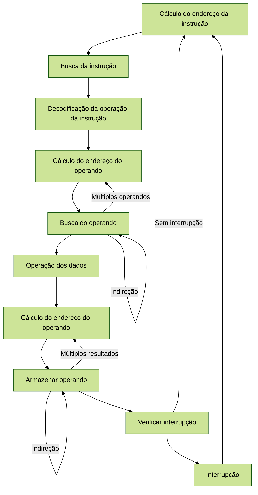

É possível obter um melhor desempenho tirando vantagem das melhorias da tecnologia. Uma forma de aprimorar esse
desempenho é utilizando circuitos mais rápidos. Melhorias organizacionais no processador também podem melhorar a
performance, como por exemplo usar mais registradores e o uso de uma memória cache maior. Outra abordagem organizacional
é utilizar um pipeline de instruções.

O pipeline de instruções é uma ideia semelhante a uma linha de montagem ou de produção. A linha de montagem tira a
vantagem do fato de que um produto passa por vários estágios de produção. Ao implantar esse processo, é possível
trabalhar simultaneamente em diferentes instruções que estejam em diferentes estágios. De forma simplificada, os
estágios de uma instrução são:

* Buscar: lê a próxima instrução da memória principal para o processador
* Executar: interpreta o opcode e efetua a ação desejada
* Interromper: se o sistema utiliza E/S controlada por interrupção, analisa se houve uma interrupção para atendê-la
* Ciclo indireto: a busca de um operando na memória pode haver acessos adicionais, em que determinada posição de memória
  não possui o valor necessário, e sim outro endereço que deve ser buscado. É uma ideia similar ao uso de ponteiros.

É possível quebrar esse ciclo de instruções em sub-etapas:

Essas sub-etapas acima são um fluxo complexo, e podemos simplificá-la para nosso pipeline em menos etapas. É possível,
por exemplo, organizar o ciclo de instruções em seis sub-processos:

* Buscar instrução (BI): ler a próxima instrução esperada do programa
* Decodificar instrução (DI): determinar o opcode e especificadores dos operandos
* Calcular operandos (CO): calcular o endereço efetivo de cada operando de origem, contando inclusive com indireção
* Obter operandos (OO): obter cada operando da memória para registradores
* Executar instrução (EI): efetuar a operação indicada e armazenar o resultado
* Escrever operando (EO): armazenar o resultado na memória

Sem pipeline, a execução de instruções seriam mais ou menos desta forma (T1, T2, T3, ... indicam um clock):

|             | T1 | T2 | T3 | T4 | T5 | T6 | T7 | T8 | T9 | T10 | T11 | T12 | T13 | T14 |
|-------------|----|----|----|----|----|----|----|----|----|-----|-----|-----|-----|-----|
| Instrução 1 | BI | DI | CO | OO | EI | EO |    |    |    |     |     |     |     |     |
| Instrução 2 |    |    |    |    |    |    | BI | DI | CO | OO  | EI  | EO  |     |     |
| Instrução 3 |    |    |    |    |    |    |    |    |    |     |     |     | BI  | DI  |

Utilizando a ideia de pipeline, a execução ficaria mais ou menos desta forma:

|             | T1 | T2 | T3 | T4 | T5 | T6 | T7 | T8 | T9 | T10 | T11 | T12 | T13 | T14 |
|-------------|----|----|----|----|----|----|----|----|----|-----|-----|-----|-----|-----|
| Instrução 1 | BI | DI | CO | OO | EI | EO |    |    |    |     |     |     |     |     |
| Instrução 2 |    | BI | DI | CO | OO | EI | EO |    |    |     |     |     |     |     |
| Instrução 3 |    |    | BI | DI | CO | OO | EI | EO |    |     |     |     |     |     |
| Instrução 4 |    |    |    | BI | DI | CO | OO | EI | EO |     |     |     |     |     |
| Instrução 5 |    |    |    |    | BI | DI | CO | OO | EI | EO  |     |     |     |     |
| Instrução 6 |    |    |    |    |    | BI | DI | CO | OO | EI  | EO  |     |     |     |
| Instrução 7 |    |    |    |    |    |    | BI | DI | CO | OO  | EI  | EO  |     |     |
| Instrução 8 |    |    |    |    |    |    |    | BI | DI | CO  | OO  | EI  | EO  |     |
| Instrução 9 |    |    |    |    |    |    |    |    | BI | DI  | CO  | OO  | EI  | EO  |

Desta forma, utilizamos mais do chip do processador. Vale ressaltar que em determinado tempo (coluna da nossa tabela
acima), não há duas instruções no mesmo sub-processo.

## Hazard de pipeline

Alguns fatores limitam o aumento de desempenho, e esses fatores são chamados de hazards de pipeline. Um hazard ocorre
quando o pipeline, ou alguma parte dele, precisa parar porque as condições não permitem a execução contínua. Essa
parada também é conhecida como bolha de pipeline. Existem três tipos de hazards: recursos, dados e controle.

### Hazard de recursos

Ocorre quando duas ou mais instruções que já estão no pipeline dependem do mesmo recurso. O resultado é que as
instruções precisam ser executadas em sequência ao invés de paralelo para uma parte do pipeline. Esse hazard também é
chamado de estrutural.

Exemplo: suponha que haja uma operação lenta, que gaste mais tempo que o esperado na tarefa "Executar Instrução (EI)",
as demais instruções que estão prontas para execução devem esperar até o recurso ser liberado:

|             | T1 | T2 | T3 | T4 | T5 | T6 | T7 | T8 | T9 | T10 | T11 | T12 | T13 | T14 |
|-------------|----|----|----|----|----|----|----|----|----|-----|-----|-----|-----|-----|
| Instrução 1 | BI | DI | CO | OO | EI | EI | EI | EO |    |     |     |     |     |     |
| Instrução 2 |    | BI | DI | CO | OO |    |    | EI | EO |     |     |     |     |     |
| Instrução 3 |    |    | BI | DI | CO |    |    | OO | EI | EO  |     |     |     |     |
| Instrução 4 |    |    |    | BI | DI |    |    | CO | OO | EI  | EO  |     |     |     |

### Hazard de dados

Ocorre quando há um conflito no acesso de uma posição de operando, isso é: duas instruções de um programa estão no
pipeline e ambas acessam uma mesma posição de memória ou registrador. Se as instruções são executadas em um pipeline,
é possível então que o valor seja utilizado na segunda operação antes do seu valor ser gravado na etapa de "Escrever
Operando".

Exemplo:

|             | T1 | T2 | T3 | T4 | T5 | T6 | T7 | T8 | T9 | T10 | T11 | T12 | T13 | T14 |
|-------------|----|----|----|----|----|----|----|----|----|-----|-----|-----|-----|-----|
| Instrução 1 | BI | DI | CO | OO | EI | E0 |    |    |    |     |     |     |     |     |
| Instrução 2 |    | BI | DI |    |    |    | CO | OO | EI | EO  |     |     |     |     |
| Instrução 3 |    |    | BI |    |    |    | DI | CO | OO | EI  | EO  |     |     |     |
| Instrução 4 |    |    |    |    |    |    | BI | DI | CO | OO  | EI  | EO  |     |     |

### Hazard de controle

Ocorre quando um pipeline toma uma decisão errada ao prever um desvio (if-else ou for) e acaba trazendo instruções para
o pipeline que precisam ser descartadas

Exemplo:

|             | T1 | T2 | T3 | T4 | T5 | T6 | T7 | T8 | T9 | T10 | T11 | T12 | T13 | T14 |
|-------------|----|----|----|----|----|----|----|----|----|-----|-----|-----|-----|-----|
| Instrução 1 | BI | DI | CO | OO | EI | EO |    |    |    |     |     |     |     |     |
| Instrução 2 |    | BI | DI | CO | OO | EI | EO |    |    |     |     |     |     |     |
| Instrução 3 |    |    | BI | DI | CO | OO |    |    |    |     |     |     |     |     |
| Instrução 4 |    |    |    | BI | DI | CO |    |    |    |     |     |     |     |     |
| Instrução 5 |    |    |    |    | BI | DI |    |    |    |     |     |     |     |     |
| Instrução 6 |    |    |    |    |    | BI |    |    |    |     |     |     |     |     |
| Instrução 7 |    |    |    |    |    |    | BI | DI | CO | OO  | EI  | EO  |     |     |
| Instrução 8 |    |    |    |    |    |    |    | BI | DI | CO  | OO  | EI  | EO  |     |
| Instrução 9 |    |    |    |    |    |    |    |    | BI | DI  | CO  | OO  | EI  | EO  |

