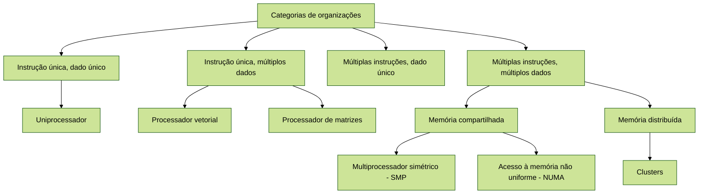

Uma abordagem válida para melhorar o desempenho de um sistema computacional é usar múltiplos processadores que possam
executar as tarefas em paralelo. As organizações comuns de múltiplos processadores são **multiprocessadores simétricos**
(SMP, do inglês symmetric multiprocessor), clusters e sistemas de **acesso não uniforme à memória** (NUMA, do inglês
nonuniform memory access).

Em relação à capacidade de processamento paralelo, é possível organizar os sistemas computacionais nas seguintes
categorias:

* Instrução única, dado único: um processador único executa uma única sequência de instruções para operar nos dados
  armazenados em uma única memória. Uniprocessadores enquadram-se nessa categoria.
* Instrução única, múltiplos dados: uma única instrução de máquina controla a execução simultânea de um conjunto de
  operações básicas em um processamento. Processadores de vetores e matrizes se enquadram nessa categoria.
* Múltiplas instruções, dado único: uma única sequência de dados é transmitida para um conjunto de processadores, onde
  cada um executa uma sequência de instruções diferentes. Este modelo não é implementado comercialmente.
* Múltiplas instruções, múltiplos dados: um conjunto de processadores que executam sequências de instruções diferentes
  simultaneamente em diferentes conjuntos de dados. SMPs, clustes e sistemas NUMA são exemplos desta categoria.

## SMP
Um SMP consiste de vários processadores semelhantes dentro de um mesmo computador, interconectados por um barramento ou
equivalente. O problema mais crítico a ser resolvido em um SMP é a coerência de cache. Esse problema de coerência ocorre
porque cada processador possui sua própria cache, e assim é possível que uma determinada informação esteja presente em
mais de uma cache ao mesmo tempo. Se esta informação na memória cache for alterada por algum processador, então a
memória principal (RAM) e as caches dos outros processadores possuirão uma versão inválida desta informação.

Uma organização de computador no formato SMP possui várias potenciais vantagens em relação a uma organização de
uniprocessador (apenas um processador na máquina), incluindo:

* Desempenho: se o trabalho a ser feito por um computador pode ser organizado de tal forma que algumas partes deste
  trabalho possam ser feitas em paralelo, então um sistema com vários processadores vai atingir desempenho melhor do que
  com um único processador do mesmo tipo
* Disponibilidade: em um multiprocessador simétrico, como todos os processadores podem efetuar as mesmas funções, a
  falha de um único processador não trava a máquina. Ao invés, o sistema pode continuar o funcionamento com desempenho
  reduzido
* Crescimento incremental: o usuário pode melhorar o desempenho de um sistema acrescentando um processador adicional
* Escalabilidade: é possível oferecer produtos com diferentes preços e características de desempenho com base no número
  de processadores configurados no sistema

É importante observar que esses benefícios são potenciais, e não garantidos. O sistema operacional deve fornecer
ferramentas e funções para explorar o paralelismo em um sistema SMP.

## Cluster
Um cluster é um grupo de computadores completos conectados, trabalhando juntos como um recurso computacional unificado.
Cada computador em um cluster é chamado de nó. Para o usuário, é possível ter a ilusão de ser apenas uma máquina 
trabalhando. O termo "computador completo" significa que cada sistema tem peças de hardware suficientes para funcionar 
por conta própria, separado do cluster.

Na literatura, a construção de clusters traz quatro benefícios:

* Escalabilidade absoluta: é possível criar clusters com qualquer quantidade de máquinas, desde poucas até milhares,
  cada uma possuindo o seu processador
* Escalabilidade incremental: um cluster é configurado de tal forma que é possível adicionar novos sistemas ao cluster
  em qualquer quantidade. Assim, um usuário pode começar com um sistema modesto e expandi-lo conforme a necessidade, sem
  ter que recriar e reconfigurar todo o cluster
* Alta disponibilidade: como cada nó é um computador independente, a falha de um deles são significa a perda do serviço
* Preço/desempenho superior: ao montar um cluster, é esperado que o resultado seja um sistema com poder computacional
  igual ou maior do que uma única máquina de grande porte, mas com um custo de construção menor

## NUMA
Um sistema NUMA é um multiprocessador de memória compartilhada, em que o tempo de acesso para determinado processador
a uma determinada palavra na memória pode variar de acordo com seu endereço. Esse tempo não uniforme vem do fato de que
a memória principal (RAM) não é um recurso compartilhado e uniforme, mas é segmentada e alocada para processadores
específicos. A memória de cada nó serve como armazenamento primário para aquele processador. Este modelo aumenta a
eficiência com que os processadores acessam e manipulam dados, já que os processadores não competem por os mesmos
recursos de memória. É possível que um processador acesse uma região de memória de outro processador, mas esta operação
é de menor prioridade e esta comunicação deve ser gerenciada pelo processador dono do recurso.
