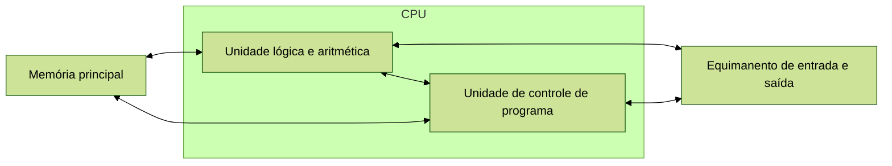
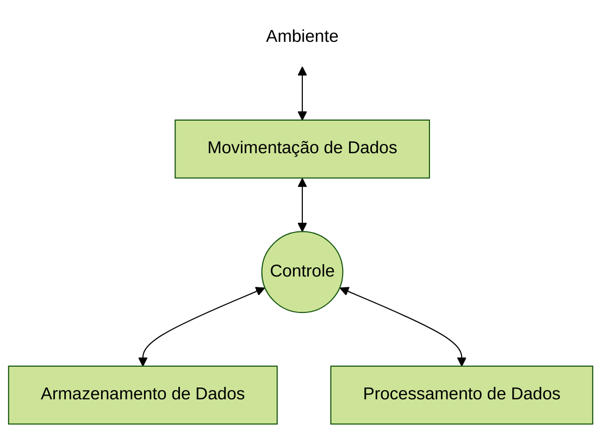
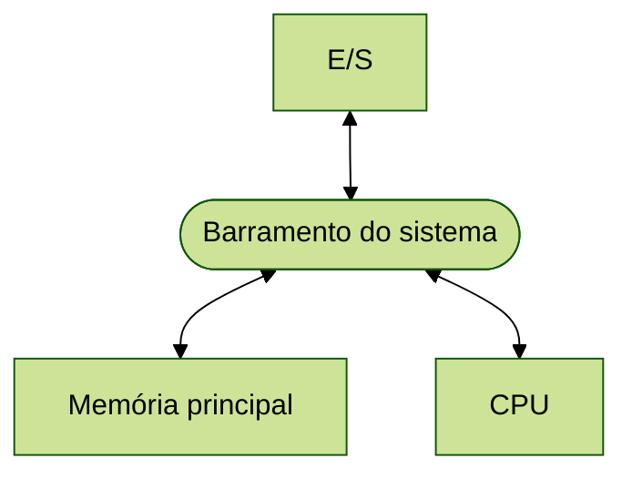

Um computador é um sistema complexo, que contém milhões de componentes eletrônicos elementares. Para entender e
descrever esses componentes, é importante reconhecer a evolução da computação, além de entender a hierarquia desses
componentes dividindo eles em subsistemas que se comunicam.

## Breve história da computação
A evolução dos computadores tem sido caracterizada pelo aumento na velocidade do processador, diminuição no tamanho dos
componentes de hardware, aumento no tamanho das memórias e na capacidade e velocidade de E/S. A performance dos
computadores foi praticamente a única coisa que evoluiu ao longo dos anos, mas o seu modo de funcionar no geral não
sofreu tantas alterações, tendo no máximo atualizações em subcomponentes específicos, como por exemplo o processador.

### ENIAC
O ENIAC (Electronic Numerical Integrator And Computer) foi projetado e construído na Universidade da Pensilvânia. Ele
foi o primeiro computador digital eletrônico de uso geral do mundo. O projeto foi uma resposta às necessidades dos EUA
durante a Segunda Guerra Mundial. Ele foi projetado inicialmente para resolver problemas de balística, para criar
tabelas de faixa e trajetória para novas artilharias. O ENIAN era uma máquina de 30 toneladas, ocupando quase 140 metros
quadrados de superfície e contendo mais de 18 mil válvulas. Quando estava em operação, consumia 140 kilowatts de
potência e conseguia realizar 5000 adições por segundo.

O ENIAC era uma máquina decimal ao invés de binária, ou seja, os números eram representados e os cálculos eram
realizados utilizando a base 10. Sua memória consistia em 20 "acumuladores", cada um capaz de manter um número decimal
de 10 dígitos. Um anel de 10 válvulas representava cada dígito. A qualquer momento, somente uma válvula estava no estado
"LIGADO", representando o dígito correspondente. Ele também precisava ser programado manualmente, por meio de ligação
de chaves e conexões de cabos.

Ele foi concluído em 1946, muito tarde para ser utilizado no esforço da guerra. Em vez disso, sua primeira tarefa foi
realizar uma série de cálculos complexos para ajudar a determinar a viabilidade da bomba de hidrogênio. O uso do ENIAC
para um propósito diferente daquele para o qual ele foi projetado mostrou sua natureza de uso geral. O ENIAC foi
desmontado em 1955.

### Máquina de von Neumann
John von Neumann foi consultor do projeto ENIAC, e junto com outros projetistas deste projeto, desenvolveram o conceito
de programa armazenado. Alan Turing desenvolveu a ideia praticamente ao mesmo tempo. A primeira publicação dessa ideia
foi proposta em 1945 na proposta para um novo computador, o EDVAC (Electronic Discrete Variable Computer).

Em 1946, von Neumann e seus colegam começaram o projeto de um novo computador de programa armazenado, conhecido como
computador IAS. Este computador é o protótipo de todos os computadores de uso geral. A figura a seguir mostra a
estrutura geral de um computador IAS:

A proposta inicial contava com os seguintes pontos:
* como o dispositivo é principalmente um computador, ele terá que realizar as operações elementares da matemática mais
  frequentemente (adição, subtração, multiplicação e divisão), portanto é útil ter partes especializadas para estas
  operações
* o controle lógico do dispositivo, ou seja, a sequência apropriada das operações, pode ser executado por um órgão de
  controle central, que ajuda o propósito de uso geral da máquina. A unidade de controle lógico serve para interpretar o
  programa e delegar o uso das outras partes operacionais do dispositivo
* qualquer dispositivo que tiver que executar operações complexas precisa ter memória para isso
* o dispositivo precisa ter unidades pra transferir informações do ambiente para seus módulos específicos (*input*)
* o dispositivo precisa ter unidades pra transferir informações dos seus módulos para o ambiente (*output*)

## Função de um computador
Tanto a estrutura quanto o funcionamento de um computador são, em essência, simples. No geral, existem apenas quatro
funções principais:

* **Processamento de dados:** o computador, naturalmente, precisa ser capaz de processar dados, isso é, transformar eles
  utilizando alguma regra ou lógica.
* **Armazenamento de dados:** o computador também deve ser capaz de armazenar dados para processá-los, ou então para
  salvar o resultado de um processamento. Assim, vai existir pelo menos a função de armazenamento de dados a curto
  prazo. Também é importante o computador realizar o armazenamento de dados a longo prazo, normalmente através de
  arquivos.
* **Movimentação de dados:** o computador também precisa ser capaz de movimentar dados entre ele e o mundo exterior.
  Essa movimentação pode utilizar um dispositivo conectado diretamente ao computador (mouse, teclado, monitor), e nesse
  caso o processo é conhecido como entrada/saída (E/S), e o dispositivo é chamado de periférico. Quando os dados são
  movimentados pela rede, o processo é conhecido como comunicação de dados.
* **Controle:** é preciso haver controle das três funções anteriores. Dentro do computador, uma unidade de controle
  gerencia os recursos do computador e coordena o desempenho de suas partes em resposta às instruções.

A figura a seguir representa essas funções básicas e como elas se conectam:

## Estrutura básica de um computador

A estrutura básica interna de um computador é representado na figura a seguir:

* CPU: controla a operação do computador e realiza o processamento de dados. Normalmente é chamado apenas de processador
* Memória principal: armazena os dados
* E/S: realiza a função de movimentação de dados com o ambiente externo
* Barramento: interconexão entre os componentes. Na prática é uma série de fios condutores que conectam todos os
  componentes

É possível ter um ou mais de cada um dos componentes mencionados acima. No início da computação, isso não era tão comum,
por exemplo a maioria das máquinas tinha apenas um processador, mas nos anos recentes, aumentou-se o uso de múltiplos
computadores ou múltiplas memórias em um único computador.

Cada componente básico desse também possui suas subdivisões internas, que serão vistas em aulas posteriores.

