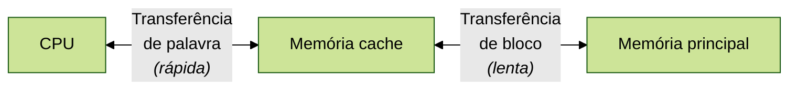

A memória do computador é organizada de forma hierárquica. No nível mais perto do processador estão os registradores. Em
seguida, vem um ou mais níveis de cache, indicados por L1, L2, e assim por diante. Após, vem a memória principal, que
normalmente é de acesso aleatório e dinâmico (RAM). Esses níveis de memória são considerados internos ao computador.
Existem também níveis hierárquicos de memória externa, com o próximo nível sendo um ou mais discos rígidos fixos (HD ou
SSD), e por último as mídias removíveis (CD, Pen-drive, etc).

À medida que descemos na hierarquia de memória, o custo por bit diminui, o que permite uma maior capacidade de
armazenamento. Em contrapartida, o tempo de acesso também aumenta conforme avançamos na hierarquia. Em um mundo ideal,
apenas memórias mais rápidas são utilizadas, mas por conta do alto custo, as hierarquias existem para baratear o
projeto. O desafio então se torna organizar os dados e os programas na memória de modo que os blocos de memória
acessados com mais frequência estejam nas memórias mais rápidas possíveis.

Em geral, existe uma maior probabilidade que a maioria dos acessos futuros à memória principal, feitos pelo processador,
sejam para blocos de memória acessados recentemente. Assim, a *cache* mantém automaticamente uma cópia de alguns dos
blocos de memória usados recentemente. Se o *cache* for projetado corretamente, na maior parte do tempo o processador
solicitará palavras da memória que já estão no *cache*.

## Características dos sistemas de memória
A seguir estão as principais características dos sistemas de memória:

* Localização:
  * interna: registradores, *cache*, RAM
  * externa: HD, SSD, mídias removíveis, etc
* Capacidade: para a memória interna, é normalmente expressa em *bytes* ou palavras. Para a memória externa, é
  normalmente expressa em *bytes*.
  * a palavra é a unidade "natural" de organização de memória. É uma sequência de tamanho fixo que a CPU processa em 
    conjunto.
* Método de acesso:
  * acesso sequencial: a memória é organizada em unidades de dados chamados registros. O acesso é feito em uma sequência
    linear específica. As unidades de fita são de acesso sequencial.
  * acesso direto: similar ao acesso sequencial, mas os blocos individuais tem um endereço exclusivo, baseado no local
    físico. As unidades de disco magnético são de acesso direto.
  * acesso aleatório: cada local da memória tem um mecanismo de endereçamento exclusivo, e qualquer local pode ser
    acessado diretamente de forma aleatória. A memória principal, alguns sistemas cache e os SSD são de acesso
    aleatório.
  * acesso associativo: permite acessar memória não por endereço, mas por um número de bits desejados em uma palavra,
    permitindo o acesso com base em uma parte do conteúdo ao invés do endereço de memória. As memórias cache podem usar
    esse método de acesso.
* Parâmetros de desempenho:
  * tempo de acesso (latência): tempo gasto desde o instante que um endereço é solicitado até o instante que os dados
    foram salvos ou retornados da memória.
  * tempo de ciclo de memória: tempo de acesso mais qualquer tempo adicional antes que um próximo acesso possa iniciar.
* Volatilidade:
  * volátil: a informação se perde quando a energia elétrica é desligada
  * não volátil: nenhuma energia elétrica é necessária para manter a informação

## Hierarquia de memória
Como citado anteriormente, empregar uma hierarquia de memória pode ajudar a equilibrar o custo monetário de um projeto
computacional.

Uma hierarquia comum é composta por:
1. Registradores
2. Memória cache
3. Memória principal
4. Memória secundária
5. Memória em mídia removível

Enquanto se desce na hierarquia, ocorre normalmente o seguinte:
1. Diminui o custo por bit
2. Aumenta a capacidade em bits 
3. Aumenta o tempo de acesso da memória
4. Diminui a frequência de acesso a esta memória pelo computador

## Princípios da memória cache
O uso da memória cache visa encontrar um meio-termo, obtendo velocidades mais próximas das memórias mais rápidas e, ao
mesmo tempo, disponibilizar uma capacidade ao preço de memórias mais baratas.

O cache contém uma cópia de partes da memória principal. Quando o processador tenta ler uma palavra da memória, primeiro
verifica-se se a palavra já está no cache. Se estiver, ela já é entregue ao processador. Se não, um bloco da memória
principal, consistindo em um número fixo de palavras, é lido para o cache e depois a palavra é fornecida ao processador.
Quando um bloco de dados é levado para o cache por conta de uma única referência de memória, é provável haver
referências futuras a esse mesmo local ou a outras palavras no mesmo bloco, e isto se chama fenômeno de **localidade de
referência**.

## Algoritmos de substituição
Uma vez que o cache estiver cheio e um novo bloco precisar ser trazido, um dos blocos existentes precisa ser
substituído. Existem vários algoritmos de substituição na literatura, e os quatro mais comuns são:

* LRU (*least recently used*): substituir o bloco que foi usado por último
* FIFO (*first-in-first-out*): substituir o bloco que esteve no cache por mais tempo
* LFU (*least frequently used*): substituir o bloco usado menos vezes até agora
* Aleatório: substituir uma linha aleatória do *cache*

## Política de escrita
Quando um bloco estiver para ser substituído do *cache*, existem dois casos a se considerar: se o bloco não tiver sido
alterado, ele pode ser substituído sem problemas. Se pelo menos uma operação de escrita tiver sido realizada em uma
palavra desse bloco no *cache*, é necessário atualizar a memória principal com o novo valor. Existem diversas políticas
de escrita na RAM para essas alterações, sendo os principais:

* *write-through*: todas as operações de escrita são feitas na memória principal e também na memória cache, garantindo
  que os dados sejam sempre válidos. A principal desvantagem é que ela gera um tráfego de memória que pode se tornar um
  gargalo de performance.
* *write-back*: as atualizações são feitas apenas no *cache*, e só são refletidas na memória principal antes da
  substituição daquele bloco. A principal desvantagem é que essa técnica pode invalidar partes da memória principal, já
  que aquela memória pode ter sido atualizada por outra parte do sistema, por exemplo, por um módulo de E/S.
