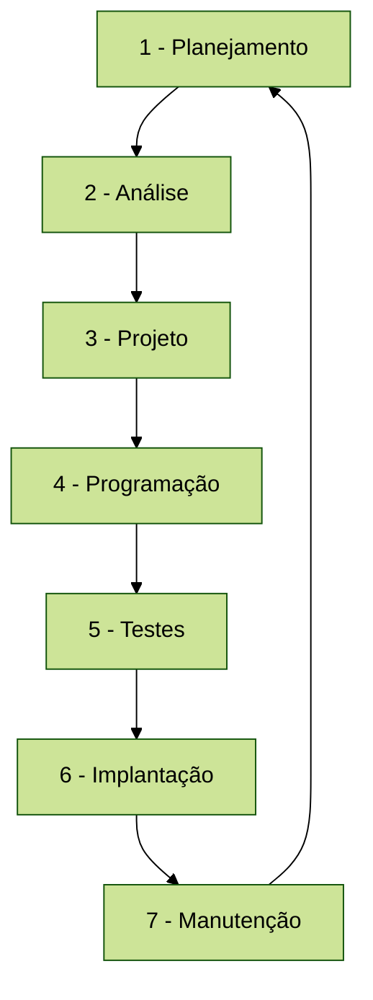
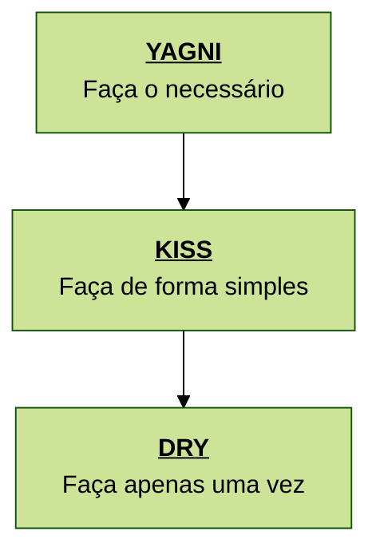

## Ciclo de vida do software (*Software Development Life Cycle* - SDLC):

O processo típico do SDLC consiste em sete etapas:

* **1 - Planejamento:** Define o escopo, recursos necessários, cronograma, orçamento e metas do projeto. Entrega o plano
  inicial do projeto.
* **2 - Análise:** Coleta, revisa e documenta a necessidade do cliente (através de requisitos funcionais) e como o
  sistema deve se comportar (através de requisitos não-funcionais). Entrega a documentação de requisitos.
* **3 - Projeto:** Realiza o design de alto nível da solução (bancos de dados, linguagens, infraestrutura, etc.) e
  também o design de baixo nível (diagramas de classes, designs de interface, etc.). Entrega o SDD (*software design
  document*).
* **4 - Programação:** Desenvolvimento do projeto. Aqui os padrões de projeto e arquitetura de software são aplicados
  para a codificação do sistema projetado. Entrega o protótipo do software funcional.
* **5 - Testes:** Revisa o programa e corrige *bugs*. Testadores ou scripts automáticos procuram por bugs, falhas de
  segurança e problemas de performance. Entrega o software refinado e testado.
* **6 - Implantação**: O software sai do ambiente de testes/homologação/QA e vai para um ambiente de produção. Entrega
  o software disponível para os usuários finais.
* **7 - Manutenção**: Correções de bugs em produção, atualizações de segurança, desenvolvimento de novas funcionalidades
  solicitadas pelo mercado. Entrega código atualizado e otimizado.

SLDC não é cascata e nem ágil. Esta framework é genérica o suficiente para ser utilizada em qualquer destes modelos, ou
até outros. A escolha depende dos requisitos do projeto e da preferência da equipe.

## Principais acrônimos da engenharia de software

Para começarmos a olhar algumas práticas para a etapa 4 do SDLC (programação), vamos conhecer os principais acrônimos
conhecidos pelos desenvolvedores. Estes acrônimos são filosofias de desenvolvimento que servem como boas práticas para
a criação de código mais fácil de entender e manter.

* SOLID: princípios de design, baseados em orientação a objetos, que visam tornar o software mais compreensível e fácil
  de manter. Veremos com mais detalhes na segunda parte da disciplina.
* DRY (*don't repeat yourself* - não se repita): se uma lógica está em mais de um lugar, ela deve ser abstraída.
  **DRY não tem a ver com código duplicado, e sim com duplicação de lógica/conhecimento**.
* KISS (*keep it simple* - mantenha as coisas simples): evite superengenharia (*overengineering*), e aplique conceitos
  simples sempre que possível, mantendo as soluções complexas para problemas complexos.
* YAGNI (*you ain't gonna need it* - você não vai precisar disso): não desenvolva funcionalidades "para o futuro",
  tentando prever situações que talvez nunca aconteçam.

