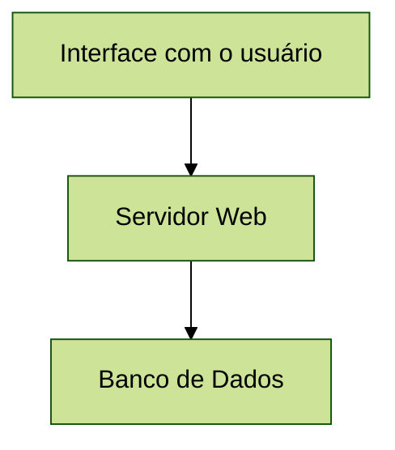
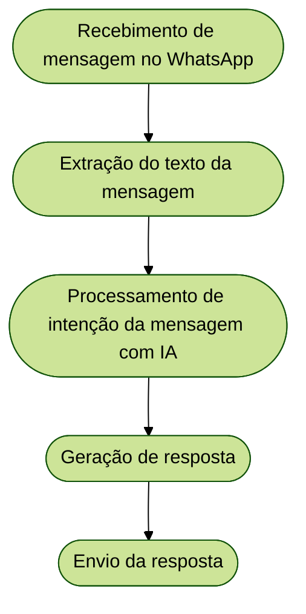
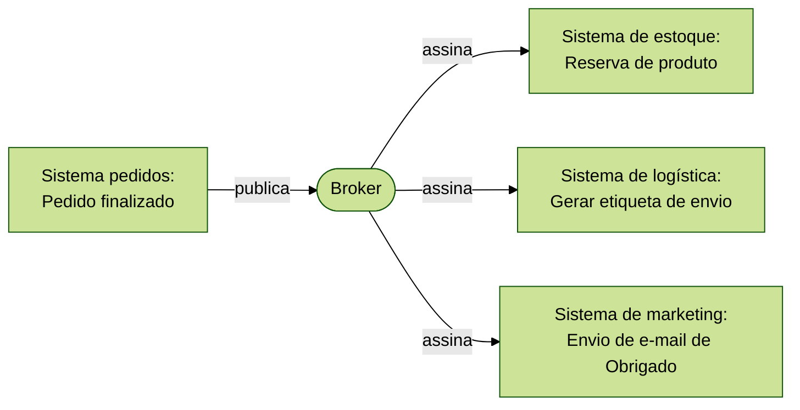

## Arquitetura em camadas

* organização do código em grupos horizontais
* cada camada tem uma responsabilidade e funcionalidade específica
* uma camada só se comunica com as camadas vizinhas
* as camadas superiores dependem das inferiores, mas as inferiores não possuem nenhuma dependência com quem as chama
* normalmente, as camadas seguem de mais "alto nível" para "baixo nível"
* exemplo:

* vantagens:
  * é possível testar cada camada de forma isolada
  * é mais fácil localizar onde um erro está acontecendo
  * é possível times diferentes desenvolverem camadas diferentes em paralelo
* desvantagens:
  * cada camada adiciona mais um pequeno custo de performance na comunicação
  * às vezes é necessário manter código repetitivo para passar determinado dado pelas camadas
  * alterações em camadas inferiores costumam exigir alterações em todas as camadas superiores

## Arquitetura pipes-and-filters

* é uma espécie de linha de montagem
* o processamento é dividido em várias etapas independentes, chamados de filtros
* os filtros são conectados por um "pipe" (tubo) ou "stream" (fluxo), que garante que a saída do filtro A chegue na
  entrada do filtro B
* um fluxo do n8n é um exemplo de uso dessa arquitetura
* também é muito utilizado em aplicações que realizam ETL (extract-transform-load) de dados
* exemplo:

* vantagens:
  * é possível reutilizar filtros em outros processos
  * é fácil adicionar, remover ou trocar a ordem dos filtros
  * dependendo da aplicação, é possível processar dados em paralelo
* desvantagens:
  * pode haver perda de performance na conversão de dados entre os filtros
  * pode ser difícil recuperar o estado do sistema caso um filtro intermediário falhe
  * filtros funcionam melhor em ambientes *stateless* (sem manter dados de execuções anteriores)

## Arquitetura publisher-subscriber

* é uma espécie de "assinatura de revista"
* quem envia a informação (*publisher*), não sabe quem vai recebê-la
* a informação é publicada em um canal (*broker*), que funciona como mediador e a distribui para os interessados
* o interessado (*subscriber*) se inscreve para receber atualizações de um canal específico
* é possível haver tanto desacoplamento espacial (o publisher e o subscriber não precisam estar na mesma máquina) quanto
  desacoplamento temporal (o subscriber pode processar a mensagem a qualquer momento)
* exemplo:

* vantagens:
  * possui escalabilidade total em relação a adicionar e remover serviços
  * se um assinante cair, a mensagem pode ficar guardada no broker até ele voltar
* desvantagens:
  * pode ser difícil rastrear o fluxo de informação quando há centenas de tópicos
  * nem todos os assinantes recebem e processam a mensagem no exato mesmo tempo
  * o broker se torna um gargalo, e se ele cair toda a comunicação para

[//]: # (TODO: --> MVC)
[//]: # (TODO: --> MVVM)
[//]: # (TODO: --> Arquitetura Hexagonal)
[//]: # (TODO: --> Arquitetura de eventos)
